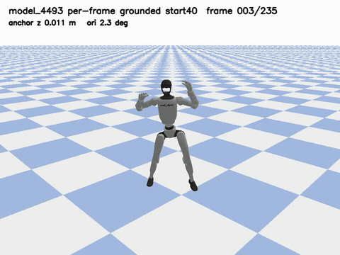
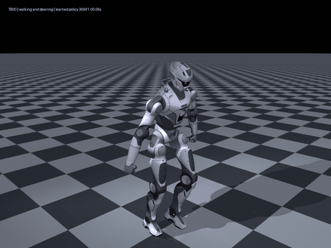
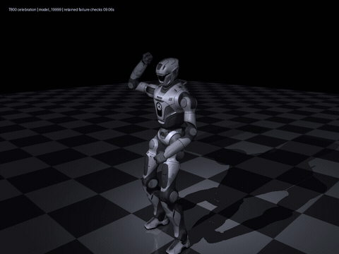
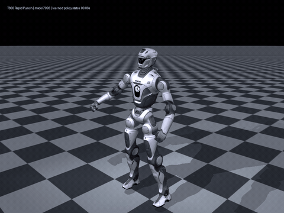

# 人形机器人仿真实践

**Humanoid Robotics — Motion Retargeting, Policy Learning & Simulation Demos**

复用开源算法和官方机器人资产，完成从视频动作恢复、机器人重定向到策略训练与回放的几项小规模实践。重点是把流程跑通、解决实际适配问题，并留下能查看、能追溯、能重新恢复的成果。

这里记录的是 **G1 / EngineAI T800 的仿真实验**，不是原创算法、完整导航系统或实机部署成果。

这是一个项目下的四项子任务。工作路径为：**开源复现 → 数据/机器人适配 → 策略训练与调参 → 仿真验收 → 成果归档**。

## 先看成果

| G1：羽毛球风格动作跟踪 | T800：行走与连续转向 |
| :---: | :---: |
|  |  |
| [完整视频](media/badminton.mp4) · [训练曲线](media/badminton_training.png) | [完整视频](media/steering.mp4) · [训练曲线](media/steering_training.png) |

| T800：庆祝动作 | T800：快速出拳（挑衅演示） |
| :---: | :---: |
|  |  |
| [完整视频](media/celebration.mp4) · [训练曲线](media/celebration_training.png) | [完整视频](media/taunt.mp4) · [训练曲线](media/taunt_training.png) |

GIF 是原始回放视频的预览，不是生成动画。完整 MP4、抽帧和指标在仓库内；GitHub 如果不能内嵌播放，可点击 **View raw / Download** 下载。动作视频来自训练策略的真实状态记录，再用官方 T800 外观和地面重渲染，不是把参考动作直接当策略输出。

想核对过程，可以直接看：[训练配置、命令和曲线](docs/training.md) · [实际结果](docs/results.md) · [关键代码](code/README.md) · [问题与心得](docs/lessons.md)。

## 我做了什么

| 工作 | 复用的基础 | 我的适配与实现 | 留下的产物 |
| --- | --- | --- | --- |
| 视频 → G1 全身动作跟踪 | GVHMR、GMR、BeyondMimic | 串联处理流程、检查坐标/关节映射、修正参考落地高度、运行训练和固定起点验证 | 管线脚本、动作跟踪视频、末期训练日志与验收记录 |
| SMP → T800 行走/转向 | SUZ SMP、MjLab、同伴交付的 12 段行走基线 | 25 关节适配、指令/朝向对齐、纠正prior EE契约；复用官方姿态与足部奖励，完成512环境质量调参和回放修正 | 转向策略回放、固定0.75m/s步态验收、真实接触指标、所选训练链曲线 |
| T800 庆祝动作 | EngineAI 官方 tracking 和 `dance_t800` | 1024 环境训练 20,000 轮；解决本机运行兼容性；修正回放初始化时序并保留失败终止检查 | 训练模型、完整动作回放、20k 曲线与恢复入口 |
| T800 挑衅演示 | G1 Moves `M_Move7 / Rapid Punch`、EngineAI tracking | G1→T800 关节映射与肘部方向修正；采用官方完整状态观测，调整已有 anchor/action-rate 奖励，1024 环境累计8000次更新、完整23.8秒回放 | 出拳/转身/踢腿策略、参考来源、所选训练链曲线与验证记录 |

行走基线及其初始 prior 来自同伴提供的匹配复现包；不能把其中的服务器训练记为我独立完成。庆祝、挑衅使用现成动作数据，不宣称原创动作设计。AI 辅助用于编码、配置与排障；算法、数据和资产来源见 [致谢与许可](THIRD_PARTY.md)。

## 结果怎样理解

- **羽毛球风格跟踪**：`model_4493` 的固定起点验证覆盖 236 帧 / 4.72 秒，未触发终止；这是动作模仿，不是有球拍、球感知与击球控制的机器人羽毛球系统。
- **行走与转向**：最终 `model_36991` 使用正确walk12特征契约，五段指令连续20秒，全部1000帧已查看，无终止、XML静态关节限位超出0。三次回放都完成1000步；转向后半程均速约0.56–0.73m/s（目标0.75），转向过渡仍欠速、有残余脚滑，不称精确控制或全部工况收敛。
- **固定速度步态验收**：同一模型固定+x、0.75m/s、500步无终止；均速0.738m/s，单脚支撑89.6%，脚高相关-0.814，接触脚滑0.088/0.103m/s，抬脚P95为8.17/9.23cm，达到此前约定的直行门槛。另附[完整10秒视频](media/steering_fixed075.mp4)；500帧全部查看。这不是所有转向或随机起点的严格门槛通过声明。
- **双向转弯补充**：主视频的三次转弯是逆时针；另外使用同一策略完成三次顺时针转弯，连续1000步无终止、全部1000帧已查看。[顺时针20秒视频](media/steering_clockwise.mp4) · [实测指标](evidence/steering_clockwise_metrics.json)。只扩大展示镜头以保留完整双脚，没有改策略或运动状态。
- **庆祝/挑衅动作**：固定起点、关闭随机扰动，保留原始失败终止项；完整参考动作的验证结果逐项保存在 [结果说明](docs/results.md)。回放不是 sim2real，也不是 MuJoCo 中重新执行策略的 sim2sim。
- **挑衅展示**：`model_7996` 完成原始1190帧，所有帧已查看。全局 anchor 平均/最大位置误差约0.168/0.435m，相对身体平均误差约0.116m；水平漂移较旧候选改善，但仍不称精确轨迹复现。
- **历史变速试验**：行走基线 `model_29999` 的随机速度响应保留为独立 [视频](media/speed_response.mp4) 与 [记录](evidence/speed_response_summary.json)。启动段存在最大约0.093rad的短暂关节限位超出，不作为当前转向质量通过证据，也不与新策略的指标混为一组。

训练曲线直接取自 TensorBoard，公开对应 [CSV](evidence/) 和 [绘图脚本](scripts/build_showcase.py)。浅色是原始值，深色是过去 100 轮均值；虚线标明续训/配置边界，平滑线不跨边界。只有单个种子，不伪造多次实验误差带，也不把奖励上升等同于动作通过验证。若奖励权重改变，边界两侧的奖励数值不能直接当作性能提升比较。

## 代码与恢复

- [关键适配代码](code/)：T800 资产/动作尺度、转向配置、确定性评估、动作数据映射和策略状态渲染。
- [恢复与运行说明](docs/reproduce.md)：看视频、重画曲线、下载完整材料、恢复回放与重新训练。
- [视频到机器人原管线代码](code/pipeline/)：迁入原有源码固定、环境与数据检查工具；旧仓库作为后台存档，不再拆成重复公开项目。
- [本人完整恢复归档](https://github.com/jkl-ddl/humanoid-robotics-reproduction)：私有 Release 保存匹配的源码、参考动作、选定模型和原始日志；避免把许可未确认的数据混入公开仓库。访问需本人的 GitHub 权限。

当前`restore-20261004-walk12`四个核心包已从GitHub重新下载、核对SHA256并安全解压；下载后的36991再次完成1000步转向和500步固定0.75m/s验收，原直行门槛仍通过。验证记录见恢复库[RESTORE_VALIDATION.md](https://github.com/jkl-ddl/humanoid-robotics-reproduction/blob/main/RESTORE_VALIDATION.md)。SMP运行镜像从官方基础镜像和在线依赖重建；Native Isaac仍复用已有安装，不声称全新电脑依赖安装已经测试。

本仓库是成果入口与小规模实验记录，不把几个配置文件包装成完整训练框架。模拟器、受限人体模型和第三方运行库按固定版本从官方渠道安装，不随包重新分发。

## 实际收获

最重要的经验不是“多训练几轮”，而是让 **数据、prior、机器人关节、reset、特征和验收口径保持一致**。早期遇到过滑行策略、错误的 head/waist 审计映射、脚滑指标定义差异和回放重复 reset；处理过程与适合面试说明的简短总结放在 [实践心得](docs/lessons.md)。

原创文档和辅助工具使用 [MIT 许可](LICENSE)。上游框架、动作、模型和资产保持各自许可；归档或公开不改变这些条件。
